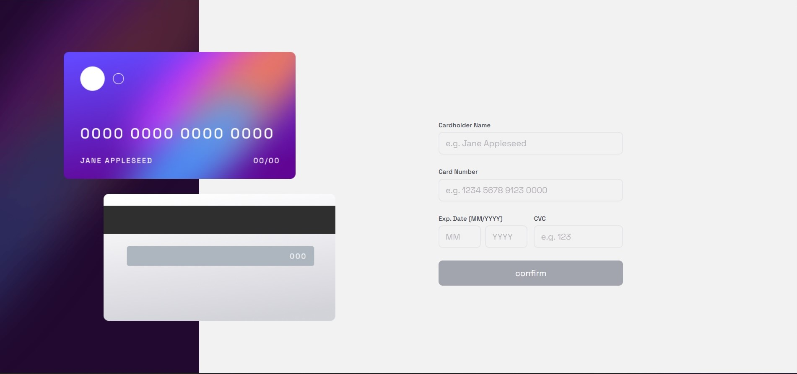

# Card Details - Experience with formik + yup

This project is my first Experience with formik + yup project [Card Details](https://654bd9f5d61887337fdaf2c5--famous-faun-95a861.netlify.app/).

## Table of contents

- [Overview](#overview)
  - [The challenge](#the-challenge)
  - [Screenshot](#screenshot)
  - [Links](#links)
- [My process](#my-process)
  - [Built with](#built-with)
  - [What I learned](#what-i-learned)
  - [Continued development](#continued-development)
  - [Useful resources](#useful-resources)
- [Author](#author)
- [Acknowledgments](#acknowledgments)

**Note: Delete this note and update the table of contents based on what sections you keep.**

## Overview

### The challenge

Users should be able to:

- View the optimal layout for the site depending on their device's screen size!
- Work with some validations
- I would update this section if new features added!

### Screenshot



### Links

- Live Site URL: [Card Details](https://654bd9f5d61887337fdaf2c5--famous-faun-95a861.netlify.app/)

## My process

### Built with

- Semantic HTML5 markup
- CSS custom properties
- Flexbox
- CSS Grid
- Mobile-first workflow
- [TailwindCss](https://tailwindcss.com/) - For Styles
- [React](https://reactjs.org/) - JS Library
- [Formik](https://formik.org/) - Build Forms In React, Without The Tears!
- [Yup](https://www.npmjs.com/package/yup) - Validate Inputs Easy And Enjoyable

### What I learned

I proudly learned:

- How to validate forms in react using formik and yup
- New expreiences with regex

```jsx
<BaseInput
  name="month"
  {...formik.getFieldProps("month")}
  placeholder="MM"
  errorStyle={formik.errors.month && formik.touched.month}
/>;
{
  formik.errors.month && formik.touched.month && (
    <div className="pt-1 pl-2 text-xs text-red-500">{formik.errors.month}</div>
  );
}
```

<!-- ### Continued development

Use this section to outline areas that you want to continue focusing on in future projects. These could be concepts you're still not completely comfortable with or techniques you found useful that you want to refine and perfect. -->

<!-- ### Useful resources

- [Nextjs Docs](https://nextjs.org/) - This helped me for many reasons. I really liked this pattern and will use it going forward.
- [Tailwindcss Docs](https://tailwindcss.com/) - This is an amazing article which helped me finally line-clamp inside it's. I'd recommend it to anyone still learning this concept. -->

## Author

<!-- - Website - [Add your name here](https://www.your-site.com) -->
<!-- - Frontend Mentor - [@yourusername](https://www.frontendmentor.io/profile/yourusername) -->

- github - [@mohammadreza0110](https://github.com/mohammadreza0110)

<!-- ## Acknowledgments

This is where you can give a hat tip to anyone who helped you out on this project. Perhaps you worked in a team or got some inspiration from someone else's solution. This is the perfect place to give them some credit.

**Note: Delete this note and edit this section's content as necessary. If you completed this challenge by yourself, feel free to delete this section entirely.** -->
